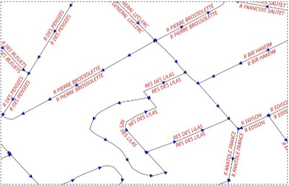

# sens_numerisation-qgis-plugin

sens_numerisation_qgis_plugin is a Python plugin that displays the digitization direction for the features of an active layer.

french : Affiche le sens de numérisation pour les entités d'une couche active

## Pré-requis

Mandatory : The "plugin\_maitre" must be installed.
Link to the plugin maître : [maitre-qgis-plugin sur GitHub](https://github.com/IGNF/maitre-qgis-plugin)

## Fonctionnalités

French : 
* Affiche le sens de numérisation pour les entités d'une couche active

English :
* displays the digitization direction for the features of an active layer

## Contacts

- Mainteneur principal : gerome.pecheur@ign.fr
- Organisation : [IGNF](https://github.com/IGNF)
- Issues GitHub : https://github.com/IGNF/sens_numerisation-qgis-plugin/issues

## Ressources

User documentation : 

## Licence

GNU AGPL v3